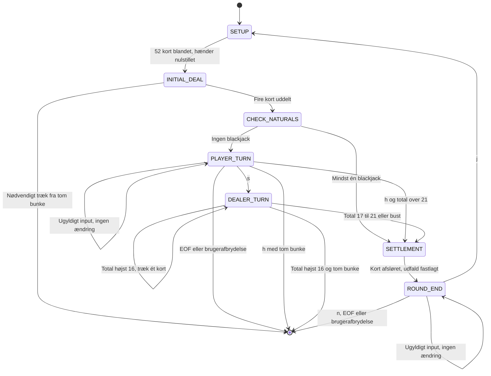

# Kravspecifikation for Blackjack

## 1. Formål og afgrænsning

- **P-01:** Systemet skal afvikle Blackjack-runder for præcis én menneskelig spiller mod én systemstyret dealer via konsollen. Verifikation: en komplet runde kan gennemføres med konsolinput og konsoloutput uden at oprette yderligere spillere.
- **P-02:** En runde skal kunne gennemføres uden indtastning, opbevaring eller beregning af indsatser, chips, saldo eller udbetaling. Verifikation: et komplet rundeforløb kræver ingen økonomiske oplysninger og viser ingen økonomiske resultater.
- **P-03:** Skoleprojektets senere implementering skal opnå mindst 95 % linjedækning og mindst 95 % forgreningsdækning hver for sig, målt efter NFR-08–NFR-10. Verifikation: en dækningsmåling opfylder begge grænser.
- **P-04:** Denne første leverance skal bestå af præcis én projektfil, `docs/kravspecifikation.md`. Verifikation: leverancens filliste indeholder alene denne fil og ingen implementering, tests, README eller arbejdsplan. Git-metadata er ikke projektfiler.

Kravene beskriver den kommende implementerings observerbare adfærd. Testnavnene i kapitel 9 er en kontrakt for den senere testsuite; de angiver ikke, at tests eller programkode allerede findes. Afgrænsningerne i kapitel 10 er en del af kravgrundlaget. Hvert krav identificeres af sit præfiks og nummer; henvisninger til samme ID er ikke nye krav.

## 2. Aktører

- **ACT-01 — Player:** Spilleren er et menneske, som afgiver sine valg gennem konsollen. Kun spillerens gyldige valg af hit, stand eller svar ved rundens afslutning må udløse de tilsvarende handlinger. Verifikation: et konsolforløb med ugyldigt input efterfulgt af et gyldigt valg udfører kun det gyldige valg.
- **ACT-02 — Dealer:** Dealeren er systemstyret og følger en deterministisk regelmaskine, ikke AI. For samme hånd og samme rækkefølge af resterende kort skal dealerens trækforløb være identisk uden menneskeligt input. Verifikation: to afviklinger med identiske data giver samme korttræk og samme sluthånd.

## 3. Domænemodel

En `Card` beskrives af en `Suit` og en `Rank`. En `Deck` rummer de kort, som endnu ikke er uddelt. Uddelte kort indgår i den relevante `Hand`. En `Round` forbinder bunken, spillerens hånd, dealerens hånd og rundens aktuelle tilstand. Afgørelsen af runden resulterer i ét `Outcome`. Begreberne nedenfor fastlægger data og betydning, ikke en bestemt fordeling på klasser eller metoder.

Begrebsliste:

- **DM-01 — Suit:** Repræsenterer kortets kulør og bærer præcis én af værdierne `CLUBS`, `DIAMONDS`, `HEARTS` eller `SPADES`. Kan besvare, hvilken kulør et kort har. Verifikation: de accepterede kulører er præcis de fire angivne værdier.
- **DM-02 — Rank:** Repræsenterer kortets rang og bærer præcis én af værdierne `TWO`, `THREE`, `FOUR`, `FIVE`, `SIX`, `SEVEN`, `EIGHT`, `NINE`, `TEN`, `JACK`, `QUEEN`, `KING` eller `ACE`. Kan besvare, om rangen er et es, et billedkort eller et talkort, og hvilken grundværdi den har efter R-03. Verifikation: en datadrevet prøve over alle 13 værdier giver den angivne klassifikation og grundværdi.
- **DM-03 — Card:** Repræsenterer ét kort og bærer én gyldig `Suit` og én gyldig `Rank`. Kan besvare sin kulør, rang og grundværdi; kortets værdi i en bestemt hånd følger håndens es-justering. Verifikation: kortet med `HEARTS` og `ACE` har disse to egenskaber og grundværdi 11, også når en hånd tæller det som 1.
- **DM-04 — Deck:** Repræsenterer den ordnede samling af resterende kort. Bærer kortenes rækkefølge og kan besvare antal resterende kort, om bunken er tom, og hvilket kort der står forrest til næste uddeling. Verifikation: efter uddeling af det forreste kort i en kendt rækkefølge er antallet reduceret med én, og det efterfølgende kort står forrest.
- **DM-05 — Hand:** Repræsenterer én parts ordnede samling af modtagne kort. Bærer kortene og kan besvare kortantal, justeret total, om hånden er soft, om den er blackjack, og om den er bust. Verifikation: hånden A, A, 9 giver kortantal 3, total 21, soft sand, blackjack falsk og bust falsk. Beregnede egenskaber beskriver altid de aktuelle kort.
- **DM-06 — Round:** Repræsenterer én afvikling med én `Deck`, én `Hand` for `Player`, én `Hand` for `Dealer`, én tilstand fra kapitel 6 og oplysning om dealerens skjulte kort. Efter afgørelsen bærer den ét `Outcome`; før afgørelsen er udfaldet endnu ikke fastlagt, hvilket ikke er et ekstra udfald. Kan besvare, hvis tur det er, hvilke kort spilleren må se, og om runden er afgjort. Verifikation: en runde uden blackjack går efter startuddelingen til `PLAYER_TURN` med to kort i hver hånd, skjult andet dealerkort og intet fastlagt udfald.
- **DM-07 — Outcome:** Repræsenterer resultatet af en afgjort runde og bærer præcis én værdi fra R-14. Kan besvare, om spilleren vandt med blackjack, spilleren vandt på anden måde, dealeren vandt, eller runden blev uafgjort. Verifikation: hver af de fire værdier svarer til præcis én af disse betydninger, og en femte værdi afvises.

Notation i håndeksempler: A betyder `ACE`, J betyder `JACK`, Q betyder `QUEEN`, og K betyder `KING`; 2–10 angiver de tilsvarende engelske rank-værdier. Gentagne ranks i samme prøve anvender forskellige kulører. Prøver med en fast bunke bruger en kendt rækkefølge efter blandingen og bevarer alle 52 unikke kort, medmindre prøven udtrykkeligt undersøger en isoleret hånd eller en ufuldstændig bunke.

## 4. Normative spilleregler (R-xx)

- **R-01:** Spillet skal bruge ét komplet kortspil på 52 kort: fire kulører gange 13 ranks, med præcis ét kort for hver kombination og ingen jokere.
- **R-02:** Ved hver rundes start skal bunken genetableres med alle 52 kort og blandes før første uddeling. Rester fra forrige runde må ikke videreføres som startbunke.
- **R-03:** Kort med rank 2–10 skal have deres pålydende værdi. J, Q og K skal have værdien 10. A skal tælle som 11 eller 1 efter R-04.
- **R-04:** Håndens total skal først beregnes med alle esser som 11. Så længe totalen overstiger 21, og der findes et es, der stadig tælles som 11, skal ét sådant es ad gangen nedjusteres til 1. Justeringen skal stoppe straks totalen er højst 21, eller alle esser er nedjusteret.
- **R-05:** En hånd skal være soft, hvis og kun hvis mindst ét es efter R-04 stadig tælles som 11.
- **R-06:** Startuddelingen skal give spilleren to kort og dealeren to kort. Dealerens andet kort skal være skjult indtil indgangen til `DEALER_TURN`. Hvis en genvej springer denne tilstand over, skal kortet i stedet afsløres ved indgangen til `SETTLEMENT`.
- **R-07:** Blackjack skal betyde præcis to kort med justeret total 21, altså ét es og ét kort til værdien 10. En total på 21 med tre eller flere kort skal ikke være blackjack.
- **R-08:** Blackjack skal slå enhver hånd på 21, som ikke er blackjack. To blackjacks skal give `PUSH`.
- **R-09:** Under `PLAYER_TURN` skal spilleren kunne vælge hit, som giver ét kort, eller stand, som afslutter turen. Hit skal kunne gentages uden en særskilt antalsgrænse, indtil spilleren buster eller vælger stand. En total på 21 uden blackjack skal fortsat tillade begge valg.
- **R-10:** En justeret total over 21 skal være bust og straks afslutte den pågældende parts tur. Hvis spilleren buster, skal udfaldet være `DEALER_WIN`, og dealeren må ikke trække yderligere kort.
- **R-11:** Dealeren skal trække præcis ét kort ad gangen og genberegne totalen, så længe den er højst 16. Ved en total på mindst 17 og højst 21 skal dealeren stå; ved en total over 21 gælder bust efter R-10.
- **R-12:** Dealeren skal stå på soft 17, herunder A, 6. S17 er valgt for at gøre alle dealerhænder med total 17 til samme stopbetingelse. H17, hvor dealeren trækker på soft 17, er udtrykkeligt fravalgt for at undgå denne særskilte trækregel.
- **R-13:** Efter at blackjack-prioriteten i R-08 og bust i R-10 er afgjort, skal udfaldet mellem to øvrige hænder uden bust afgøres alene ved deres justerede totaler: højeste total vinder, og lige totaler giver `PUSH`. Kortantal, kulør og rækkefølge må ikke bryde en sådan lighed.
- **R-14:** En afgjort runde skal have præcis ét af følgende udtømmende udfald: `PLAYER_BLACKJACK`, `PLAYER_WIN`, `DEALER_WIN` eller `PUSH`. `PLAYER_BLACKJACK` betyder, at spilleren alene har blackjack; dealerens blackjack giver `DEALER_WIN`, medmindre begge har blackjack. Ingen femte udfaldsværdi er tilladt. Tilstandene i kapitel 6 og et endnu ikke fastlagt udfald før afgørelsen er ikke yderligere udfald.

## 5. Funktionelle krav (FR-xx)

Hvert acceptkriterium beskriver én konkret prøve, eventuelt datadrevet. En kopi af spiltilstanden omfatter kortenes rækkefølge i bunken, begge hænder, rundens tilstand, kortenes synlighed og et eventuelt udfald. Når et kriterium kræver uændret spiltilstand, sammenlignes alle disse oplysninger.

| ID | Krav | Begrundelse | Acceptkriterium |
| --- | --- | --- | --- |
| FR-01 | Opbygningen af en komplet bunke skal give præcis de 52 forskellige kombinationer i R-01. | Fastlægger kortgrundlaget. | En ny komplet bunke indeholder 52 kort, 52 forskellige kulør/rank-par og præcis fire kort af hver rank. |
| FR-02 | Blanding skal kun ændre kortenes rækkefølge og skal anvende den tilførte tilfældighedskilde. | Muliggør både tilfældig afvikling og reproducerbare prøver. | En tilført kilde, der foreskriver omvendt rækkefølge, giver netop denne rækkefølge og samme 52 kort før og efter. En blanding må gerne bevare rækkefølgen; et identisk resultat er ikke i sig selv en fejl. |
| FR-03 | Hver indgang til `SETUP` skal genetablere en komplet bunke og udføre én blanding før uddeling. | Opfylder R-02 også ved gentagne runder. | To på hinanden følgende runder registrerer hver én blanding af 52 kort; anden rundes blanding modtager også de kort, der blev brugt i første runde. |
| FR-04 | En uddeling fra en ikke-tom bunke skal fjerne og overføre præcis det forreste kort. | Forhindrer tab eller dobbeltuddeling. | Fra en kendt bunke med 52 kort giver én uddeling dens oprindelige første kort, efterlader 51 kort og bevarer de resterendes indbyrdes rækkefølge. |
| FR-05 | Startuddelingen skal ske i rækkefølgen spiller, dealer, spiller, dealer. | Gør startforløbet entydigt. | Med de første fire kort 2♣, 3♦, 4♥, 5♠ får spilleren 2♣ og 4♥, dealeren 3♦ og 5♠, og bunken har 48 kort tilbage. |
| FR-06 | Håndtotalen skal beregnes ud fra de aktuelle kort efter R-03. | Sikrer korrekte grundværdier. | En datadrevet prøve med én hånd pr. rank giver værdierne 2–10, 10 for hver af J/Q/K og 11 for A. |
| FR-07 | Beregning af håndtotal skal anvende es-justeringen i R-04 uden at ændre kortene. | Gør es-værdier afhængige af den samlede hånd. | En datadrevet prøve giver A, 6 = 17; A, 6, K = 17; A, A, 9 = 21; A, A, A, 8 = 21; A, A, K, K = 22, med uændrede kort i alle prøver. |
| FR-08 | Soft-status skal følge de esser, som stadig tælles som 11 efter justering. | Understøtter R-05 og kontrollen af S17. | A, 6 og A, A, 9 er soft; A, 6, K og 10, 7 er ikke soft. |
| FR-09 | Blackjack-detektion skal kræve både to kort og total 21. | Adskiller blackjack fra øvrige 21-hænder. | A, K og A, 10 registreres som blackjack, mens A, 5, 5 og 7, 7, 7 ikke gør. |
| FR-10 | Bust-detektion skal være sand, hvis og kun hvis den justerede total er større end 21. | Fastlægger den præcise grænse. | K, Q, A giver falsk, K, Q, 2 giver sand, og den isolerede hånd K, Q, J, 9 giver sand. |
| FR-11 | Under spillerens tur skal konsollen vise alle spillerens kort og deres justerede total før hvert handlingsvalg. | Giver spilleren de aktuelle oplysninger. | Med starthånden 5, 6 og et efterfølgende hit med 2 viser de to på hinanden følgende valgvisninger henholdsvis kortene 5, 6 med total 11 og 5, 6, 2 med total 13. |
| FR-12 | Før afsløring skal dealerens visning kun vise første kort og markøren `[skjult]` for andet kort; dealerens samlede total må ikke vises. | Forhindrer, at det skjulte kort eller totalen afsløres under spillerens tur. | To ellers identiske visninger med forskellige skjulte dealerkort er identiske og indeholder første kort samt `[skjult]`, men ingen samlet dealertotal. |
| FR-13 | Det nøjagtige input `h` under `PLAYER_TURN` skal uddele ét kort til spilleren. | Fastlægger hit-kommandoen. | Fra en spillerhånd på to kort giver `h` præcis ét ekstra kort og reducerer bunken med én. |
| FR-14 | Efter et hit uden bust skal runden forblive i `PLAYER_TURN`, også ved total 21, uden en fast grænse for antal hits. | Opfylder R-09. | Spilleren starter med 2, 3 og modtager i rækkefølge 4, 5, 7, A ved fire hits: totalerne bliver 9, 14, 21 og 22; et nyt valg tilbydes efter de første tre hits, men ikke efter det fjerde. |
| FR-15 | Det nøjagtige input `s` under `PLAYER_TURN` skal afslutte spillerens tur uden at give spilleren flere kort. | Fastlægger stand-kommandoen. | Fra en runde uden blackjack giver første valg `s` overgangen til `DEALER_TURN` med uændret spillerhånd. |
| FR-16 | Ethvert andet handlingsinput end præcis `h` eller `s` skal vise `Ugyldigt input.` og gentage samme spørgsmål uden ændring af spiltilstanden. | Gør inputvalideringen entydig. | En datadrevet prøve med tom streng, `1`, `x`, `H`, `S`, `hit`, `stand` og ` h ` viser fejlteksten, gentager spørgsmålet og bevarer spiltilstanden for hvert input. Der foretages ingen automatisk ændring af store/små bogstaver eller fjernelse af mellemrum. |
| FR-17 | Et hit, der giver spilleren bust, skal føre direkte til `SETTLEMENT` og `DEALER_WIN` uden dealertræk eller flere handlingsspørgsmål. | Opfylder R-10. | Spilleren har K, Q, dealeren 5, 6, og næste kort er 2; efter `h` er spillerens total 22, dealeren har stadig to kort, og udfaldet er `DEALER_WIN`. |
| FR-18 | Blackjack på mindst én starthånd skal afgøres i `CHECK_NATURALS` og føre direkte til `SETTLEMENT` uden yderligere kort eller handlingsinput. | Gennemfører genvejen for blackjack. | En datadrevet prøve med kun spiller-blackjack, kun dealer-blackjack og blackjack hos begge registrerer genvejen, 48 resterende kort og ingen handlingsspørgsmål. |
| FR-19 | Under dealerens tur skal totaler på højst 16 udløse ét træk ad gangen med ny beregning efter hvert kort. | Sikrer tvungne gentagne træk. | Med dealerhånden 2, 3 og næste kort 4, 5, 3 bliver totalerne 9, 14 og 17; dealeren trækker præcis tre kort. |
| FR-20 | Under dealerens tur skal totaler fra 17 til 21 afslutte trækforløbet, også når hånden er soft. | Opfylder R-11 og R-12. | En datadrevet prøve med 10, 7; A, 6; 10, 8; 10, 9; K, Q og 7, 7, 7 registrerer nul dealertræk. |
| FR-21 | Ved indgangen til `DEALER_TURN` skal dealerens andet kort og justerede total vises før et eventuelt første dealertræk. | Fastlægger afsløringstidspunktet i det normale forløb. | Efter spillerens stand viser den første dealervisning begge startkort og totalen; registreringen viser, at afsløringen kommer før første dealertræk. |
| FR-22 | Ved indgangen til `SETTLEMENT` skal et fortsat skjult dealerkort afsløres. | Dækker runder, hvor dealerens tur springes over. | En datadrevet prøve med initial blackjack og spiller-bust viser begge dealerkort ved afgørelsen, selv om `DEALER_TURN` ikke indtræffer. |
| FR-23 | Ved afgørelse skal blackjack vurderes før en almindelig sammenligning af totaler. | Håndhæver R-08 og betydningen af `PLAYER_BLACKJACK`. | En datadrevet prøve giver spiller A, K mod dealer 7, 7, 7 → `PLAYER_BLACKJACK`; spiller 7, 7, 7 mod dealer A, K → `DEALER_WIN`; begge A, K → `PUSH`. Prøver med en tre-kortshånd mod blackjack er isolerede afgørelsesprøver. |
| FR-24 | Hvis ingen har blackjack, skal spiller-bust give `DEALER_WIN`, og dealer-bust med en spiller uden bust skal give `PLAYER_WIN`. | Afgør bust før almindelige totaler sammenlignes. | En datadrevet prøve giver spiller 22 mod dealer 16 → `DEALER_WIN` og spiller 18 mod dealer 22 → `PLAYER_WIN`. |
| FR-25 | Når ingen har blackjack eller bust, skal højeste total vinde, og lige totaler skal give `PUSH`. | Opfylder R-13. | En datadrevet prøve giver 20 mod 18 → `PLAYER_WIN`, 18 mod 20 → `DEALER_WIN`, 18 mod 18 → `PUSH` og to forskellige tre-kortshænder på 21 → `PUSH`. |
| FR-26 | `SETTLEMENT` skal fastlægge ét udfald fra R-14, som ikke ændres frem til næste `SETUP`. | Forhindrer manglende, ekstra eller skiftende slutresultater. | For én runde med hvert af de fire udfald er udfaldet det samme ved indgangen til `ROUND_END` og efter ugyldigt input til spørgsmålet om ny runde. |
| FR-27 | Slutvisningen skal vise alle kort og justerede totaler for begge parter samt den tekst, der svarer til udfaldet. | Gør afgørelsen synlig. | En datadrevet prøve over de fire udfald viser begge fulde hænder uden `[skjult]` og henholdsvis `Spilleren vinder med blackjack.`, `Spilleren vinder.`, `Dealeren vinder.` eller `Uafgjort.` |
| FR-28 | Det nøjagtige input `j` i `ROUND_END` skal starte en ny runde via `SETUP` med tomme hænder og endnu ikke fastlagt udfald før startuddelingen. | Sikrer uafhængige gentagne runder. | Efter en afgjort runde giver `j` en ny `SETUP`, hvor begge hænder er tomme og forrige udfald er fjernet, efterfulgt af ny blanding og fire startkort. |
| FR-29 | Det nøjagtige input `n` i `ROUND_END` skal afslutte programmet normalt uden at starte en ny runde. | Fastlægger brugerens afslutningsvalg. | Efter slutvisningen giver `n` normal afslutning med exitstatus 0, ingen ny blanding og ingen nye inputspørgsmål. |
| FR-30 | Ethvert andet input end præcis `j` eller `n` i `ROUND_END` skal vise `Ugyldigt input.` og gentage spørgsmålet uden ændring af spiltilstanden. | Beskytter genstart og afslutning mod ugyldigt input. | En datadrevet prøve med tom streng, `1`, `x`, `J`, `N`, `ja`, `nej` og ` j ` bevarer det afsluttede resultat og viser samme spørgsmål igen for hvert input. |
| FR-31 | Forsøg på uddeling fra en tom `Deck` skal give et kontrolleret fejlsignal med teksten `Bunken er tom.` uden at uddele kort eller ændre bunken. | Definerer den defensive adfærd ved udtømt bunke. | En isoleret tom bunke giver det angivne fejlsignal ved et uddelingsforsøg, forbliver tom og producerer intet kort. Fejlsignalet er ikke et `Outcome`, og der foretages ingen genopfyldning eller blanding. |
| FR-32 | En tom `Hand` skal have total 0 og være hverken soft, blackjack eller bust. | Definerer starttilstanden før uddeling. | En isoleret tom hånd giver 0 og falsk for alle tre egenskaber. |
| FR-33 | Konsollens handlingsspørgsmål skal angive de accepterede kommandoer med teksten `Vælg handling: h = hit, s = stand.` | Gør den strenge inputkontrakt synlig. | Ved første indgang til `PLAYER_TURN` vises præcis denne spørgsmålstekst før input læses. |
| FR-34 | Konsollens spørgsmål i `ROUND_END` skal være `Ny runde? j = ja, n = nej.` | Gør valget mellem gentagelse og afslutning synligt. | Efter slutvisningen vises præcis denne spørgsmålstekst før input læses. |
| FR-35 | EOF eller brugerafbrydelse ved et inputspørgsmål skal afslutte programmet normalt uden yderligere spilhandlinger. | Undgår ubehandlede afslutningssignaler fra konsollen. | En datadrevet prøve med EOF og `KeyboardInterrupt` ved begge typer spørgsmål giver exitstatus 0, ingen traceback og ingen efterfølgende korttræk; en endnu ikke afgjort runde tildeles ikke et opdigtet udfald. |
| FR-36 | Hvis et nødvendigt korttræk under en runde møder en tom bunke, skal UI vise `Bunken er tom. Runden afbrydes.` og afslutte programmet kontrolleret med exitstatus 1 uden at fastlægge et udfald. | Definerer også reaktionen på kunstigt udtømte rundedata uden at opfinde et femte udfald. | En datadrevet fejlprøve tømmer bunken før et nødvendigt træk i `INITIAL_DEAL`, `PLAYER_TURN` og `DEALER_TURN`; hvert forsøg viser den angivne tekst og afslutter med exitstatus 1, uden traceback, genopfyldning, ny runde eller `Outcome`. Hænderne er uændrede i forhold til umiddelbart før det fejlede træk. |

## 6. Rundens tilstandsmaskine

Den normale rækkefølge er `SETUP` → `INITIAL_DEAL` → `CHECK_NATURALS` → `PLAYER_TURN` → `DEALER_TURN` → `SETTLEMENT` → `ROUND_END`. Kravene nedenfor angiver alle tilladte overgange for gyldige runder samt den defensive programafslutning i FR-36. Programstart og programafslutning er diagrammets start- og slutmarkører, ikke ekstra rundetilstande. En afbrydelse før afgørelsen efter FR-35 eller FR-36 efterlader runden uafsluttet og er ikke et femte udfald.

1. **SM-01 — SETUP:** Ved programstart og ved `j` fra `ROUND_END` skal begge hænder nulstilles, udfaldet være endnu ikke fastlagt, og en komplet bunke blandes efter FR-03. Først når dette er gennemført, skal runden gå til `INITIAL_DEAL`.
2. **SM-02 — INITIAL_DEAL:** Runden skal uddele de fire startkort efter FR-05, markere dealerens andet kort som skjult og derefter gå til `CHECK_NATURALS`. Der læses ikke spillerinput i denne tilstand. Et nødvendigt træk fra en tom bunke skal i stedet afslutte programmet efter FR-36.
3. **SM-03 — CHECK_NATURALS:** Begge starthænder skal undersøges. Hvis mindst én er blackjack, skal næste tilstand være `SETTLEMENT`; ellers skal næste tilstand være `PLAYER_TURN`. Kontrollens adgang til dealerens hånd må ikke afsløre kortet i konsollen.
4. **SM-04 — PLAYER_TURN:** Gyldigt `h` skal give ét kort og føre tilbage til `PLAYER_TURN`, når totalen er højst 21, eller direkte til `SETTLEMENT`, når totalen overstiger 21. Gyldigt `s` skal føre til `DEALER_TURN`. Ugyldigt input skal bevare tilstanden og alle spildata. EOF eller brugerafbrydelse skal afslutte programmet efter FR-35 uden at afgøre en endnu ikke afgjort runde. Et hit fra en tom bunke skal afslutte programmet efter FR-36.
5. **SM-05 — DEALER_TURN:** Ved indgang skal det skjulte kort afsløres. En total på højst 16 skal give ét kort og ny vurdering i samme tilstand. En total på 17–21, herunder soft 17, eller bust skal føre til `SETTLEMENT` uden flere kort. Der læses ikke spillerinput i denne tilstand. Et nødvendigt træk fra en tom bunke skal afslutte programmet efter FR-36.
6. **SM-06 — SETTLEMENT:** Et eventuelt skjult dealerkort skal afsløres, og udfaldet fastlægges i denne prioritetsrækkefølge: begge blackjack → `PUSH`; kun spilleren blackjack → `PLAYER_BLACKJACK`; kun dealeren blackjack → `DEALER_WIN`; spiller bust → `DEALER_WIN`; dealer bust → `PLAYER_WIN`; ellers sammenligning efter R-13. Herefter skal næste tilstand være `ROUND_END`. Der trækkes ingen kort og læses intet input i `SETTLEMENT`.
7. **SM-07 — ROUND_END:** Slutvisningen og spørgsmålet om ny runde skal vises. `j` skal føre til `SETUP`; `n`, EOF eller brugerafbrydelse skal afslutte programmet. Ugyldigt input skal bevare `ROUND_END` og alle spildata samt gentage spørgsmålet.

## 7. Ikke-funktionelle krav (NFR-xx)

- **NFR-01 — Kørsel i Thonny:** Programmet skal kunne åbnes og køres med Thonnys almindelige kørselsfunktion i en installation med Python 3.10 eller nyere uden pakkeinstallation, miljøvariabler, ændring af søgestier eller manuel ændring af arbejdsmappe. Verifikation: en ren projektkopi åbnes fra en valgfri mappe, og en komplet runde spilles i Thonny med standardindstillinger.
- **NFR-02 — Tests i Thonny:** Den senere funktionelle testsuite skal kunne åbnes og køres i Thonny med standardbibliotekets `unittest`, uden terminalkommandoer eller ekstra pakker. Verifikation: i samme rene miljø som NFR-01 køres hele testsuiten fra Thonny med bestået resultat uden installeret `coverage`.
- **NFR-03 — Runtime-afhængigheder:** Spillet skal udelukkende anvende Pythons standardbibliotek ud over projektets egen kode. Verifikation: en afhængighedskontrol af programmets importer finder ingen tredjepartspakke, og en komplet runde kan afvikles uden sådanne pakker.
- **NFR-04 — Udviklingsafhængigheder:** `coverage` skal være den eneste tilladte tredjepartsafhængighed til udvikling og test og må ikke være nødvendig for at spille eller køre funktionelle tests. Verifikation: med `coverage` utilgængelig kan både spillet og testsuiten afvikles; projektets eksterne afhængighedsliste indeholder højst `coverage`. Installation af `coverage` er kun nødvendig for selve dækningsmålingen og er adskilt fra NFR-01 og NFR-02.
- **NFR-05 — Python-version:** Program og testsuite skal understøtte Python 3.10 og nyere uden at kræve sprogfunktioner eller standardbiblioteksfunktioner, som først findes efter 3.10. Verifikation: hele testsuiten består på Python 3.10 og på den valgte nyere skoleinstallation, hvis denne anvender en nyere version.
- **NFR-06 — Adskilt I/O:** Forretningslogikken skal kunne afvikle alle rundens regelmæssige forløb med tilførte valg og kort uden at kalde `input()` eller `print()`; al konsol-I/O skal ligge i UI-laget. Verifikation: en datadrevet integrationstest gennemfører logikforløb til hvert af de fire udfald uden UI og uden mock eller erstatning af `input()` eller `print()`, med tom standardinput og opsamlet standardoutput; forløbene afsluttes korrekt uden læsefejl eller output. En kildekontrol skal desuden kunne afkræfte kravet ved at finde et kald til disse funktioner i forretningslogikken.
- **NFR-07 — Injicerbar tilfældighed:** Al tilfældighed, herunder blanding, skal kunne tilføres udefra uden ændring af globale tilfældighedskilder. Verifikation: to komplette spilforløb med identiske tilførte kilder og input giver identiske kort, tilstandsovergange og udfald, også når den globale tilfældighedstilstand ændres mellem forløbene.
- **NFR-08 — Linjedækning:** Den senere testsuite skal udføre mindst 95 % af de eksekverbare linjer inden for NFR-10's måleområde. Verifikation: antallet af dækkede linjer divideret med det samlede antal eksekverbare linjer er mindst 0,95 uden afrunding til fordel for resultatet.
- **NFR-09 — Forgreningsdækning:** Den senere testsuite skal udføre mindst 95 % af de mulige forgreningsudgange inden for NFR-10's måleområde, målt med aktiveret forgreningsmåling. Verifikation: antallet af udførte forgreningsudgange divideret med det samlede antal mulige forgreningsudgange er mindst 0,95 uden afrunding. En samlet procent, der sammenblander linjer og forgreninger, kan ikke erstatte denne måling.
- **NFR-10 — Måleområde:** Dækningsmålingen skal omfatte al projektets produktionskode, herunder domænelogik, rundestyring, UI og programstart, også produktionsmoduler som testsuiten ikke importerer. Kun testkode, standardbibliotek og tredjepartsværktøjer er uden for måleområdet; produktionskode må ikke fjernes med dækningsundtagelser. Verifikation: rapportens kildefilliste svarer til hele produktionskoden, og måleopsætningen samt kildekoden indeholder ingen udelukkelser af denne kode.
- **NFR-11 — Ugyldigt input:** Fejlagtigt konsolinput skal håndteres uden ubehandlet exception, traceback eller programafslutning. Verifikation: en datadrevet konsoltest med de ugyldige værdier i FR-16 og FR-30 fortsætter til næste gyldige valg og afsluttes normalt via `n`.
- **NFR-12 — Konsolafbrydelse:** EOF og brugerafbrydelse ved konsolinput skal håndteres som normal programafslutning med exitstatus 0. Verifikation: de fire kombinationer af de to signaler og de to spørgsmål i FR-35 giver ingen traceback eller fortsat spilaktivitet.

## 8. Kanttilfælde (EC-xx)

Rundeforløb nedenfor starter med en komplet, kontrolleret bunke. En isoleret hånd- eller afgørelsesprøve kan anvende data, som ikke kan opstå i et normalt rundeforløb, og er udtrykkeligt markeret. Det gør eksempelvis en meget høj bust-total og tre kort mod en allerede konstateret blackjack mulige at verificere uden at omgå tilstandsmaskinen.

| ID | Situation | Forventet, præcis opførsel |
| --- | --- | --- |
| EC-01 | Spilleren har K, Q og rammer 2; dealeren har 5, 6. | Spillerens total er 22 og bust; næste tilstand er `SETTLEMENT`, udfaldet er `DEALER_WIN`, og dealeren trækker nul kort. |
| EC-02 | Isoleret spillerhånd K, Q, J, 9 mod dealer 10, 7. | Totalen 39 registreres som bust og giver `DEALER_WIN` ved isoleret afgørelse. Totaler langt over 21 må ikke overses, blot fordi de er større end 22. Hånden er en defensiv prøve; normal afvikling var stoppet ved det tidligere bust. |
| EC-03 | Spilleren får A, K, og dealeren får 10, 9 ved startuddelingen. | Direkte overgang fra `CHECK_NATURALS` til `SETTLEMENT`, udfald `PLAYER_BLACKJACK`, ingen handlingsspørgsmål og ingen yderligere kort. |
| EC-04 | Spilleren får 10, 9, og dealeren får A, K ved startuddelingen. | Direkte overgang fra `CHECK_NATURALS` til `SETTLEMENT`, udfald `DEALER_WIN`, ingen handlingsspørgsmål og ingen yderligere kort. |
| EC-05 | Begge får A og et kort til værdien 10 ved startuddelingen. | Direkte afgørelse som `PUSH` uden yderligere kort eller handlingsinput. |
| EC-06 | Spilleren har A, 6 og rammer K. | Totalen ændres fra 17 til 17, fordi esset nedjusteres fra 11 til 1; hånden er ikke soft og ikke bust, og spilleren får et nyt valg. |
| EC-07 | En hånd indeholder A, A, 9. | Totalen er 21, præcis ét es tælles som 11, hånden er soft og ikke blackjack. |
| EC-08 | En hånd indeholder A, A, A, 8. | Totalen er 21, præcis ét es tælles som 11, to tælles som 1, og hånden er soft og ikke blackjack. |
| EC-09 | En hånd indeholder A, A, K, K. | Begge esser nedjusteres til 1; totalen er stadig 22, så hånden er bust og ikke soft. |
| EC-10 | Isoleret afgørelse mellem spillerens 7, 7, 7 og dealerens A, K. | Dealeren vinder med `DEALER_WIN`, selv om begge totaler er 21. Dette er en afgørelsesprøve; en normal runde med dealer-blackjack tillader ikke spillerens efterfølgende tredje kort. |
| EC-11 | Isoleret afgørelse mellem spillerens A, K og dealerens 7, 7, 7. | Spilleren vinder med `PLAYER_BLACKJACK`; almindelig sammenligning af de to totaler må ikke give push. |
| EC-12 | Spilleren står på 18, og dealeren har 10, 7. | Dealeren står med præcis 17 uden at trække; udfaldet er `PLAYER_WIN`. |
| EC-13 | Spilleren står på 18, dealeren har 10, 6, og næste kort er A. | Dealeren trækker præcis ét kort på 16, nedjusterer esset til 1 og står derefter på 17. |
| EC-14 | Spilleren står på 18, og dealeren har A, 6. | Dealeren står på soft 17 uden at trække, også hvis næste kort ville forbedre hånden. |
| EC-15 | Spilleren står på 18, dealeren har 10, 6, og næste kort er K. | Dealeren trækker ét tvungent kort, buster på 26 og stopper; udfaldet er `PLAYER_WIN`. |
| EC-16 | Spilleren står på 10, 8, og dealeren har K, 8. | Begge totaler er 18; udfaldet er `PUSH` uanset kulører. |
| EC-17 | To isolerede hænder uden blackjack er 7, 7, 7 og 10, 6, 5. | Begge totaler er 21, begge mangler blackjack, og udfaldet er `PUSH`. |
| EC-18 | Spilleren vælger `s` som første handling i en runde uden blackjack. | Spillerhånden forbliver på to kort, og næste tilstand er `DEALER_TURN`; spilleren modtager intet ekstra kort. |
| EC-19 | En isoleret bunke har ét kort tilbage. | Det sidste kort kan uddeles præcis én gang; bunken bliver tom og hverken genopfyldes eller blandes. |
| EC-20 | Der forsøges uddeling fra en isoleret tom bunke. | Det kontrollerede fejlsignal `Bunken er tom.` afgives uden kort, uden ændring af bunken og uden et ekstra `Outcome`. En normal runde fra 52 kort når ikke denne situation før spillets stopbetingelser; prøven fastlægger `Deck`-adfærden ved kunstigt udtømte data. |
| EC-21 | Spilleren indtaster tom streng ved handlingsspørgsmålet. | `Ugyldigt input.` vises, samme spørgsmål gentages, og hele spiltilstanden er uændret. |
| EC-22 | Spilleren indtaster talstrengen `1` ved handlingsspørgsmålet. | `Ugyldigt input.` vises, samme spørgsmål gentages, og hele spiltilstanden er uændret. |
| EC-23 | Spilleren indtaster det ukendte bogstav `x` ved handlingsspørgsmålet. | `Ugyldigt input.` vises, samme spørgsmål gentages, og hele spiltilstanden er uændret. |
| EC-24 | Spilleren indtaster `H` eller `S` ved handlingsspørgsmålet. | Begge afvises med `Ugyldigt input.` og nyt spørgsmål; kun de små bogstaver accepteres, og spiltilstanden er uændret. |
| EC-25 | Spilleren indtaster ` h ` eller `hit` ved handlingsspørgsmålet. | Begge afvises med `Ugyldigt input.` og nyt spørgsmål; ingen beskæring eller oversættelse af input finder sted, og spiltilstanden er uændret. |
| EC-26 | Spilleren når 21 med 7, 7, 7 uden blackjack. | Spilleren tilbydes fortsat `h` eller `s`. Vælges `h`, og næste kort er 2, buster spilleren på 23 og taber uden dealertræk. |
| EC-27 | En runde slutter via initial blackjack eller spiller-bust. | Dealerens andet kort er synligt ved `SETTLEMENT`, og den afsluttende visning indeholder begge fulde hænder og totaler uden `[skjult]`. |
| EC-28 | Ugyldigt input, herunder tom streng, `1`, `x`, `J` og `N`, gives ved spørgsmålet om ny runde. | `Ugyldigt input.` vises, spørgsmålet gentages, og udfald, hænder og bunke bevares uændret; ingen ny runde starter. |
| EC-29 | Spilleren vælger `j` efter en afsluttet runde. | En ny `SETUP` starter med tomme hænder, intet fastlagt udfald og en blanding af alle 52 kort; tidligere uddelte kort er igen til rådighed. |
| EC-30 | Spilleren vælger `n` efter en afsluttet runde. | Programmet afsluttes med exitstatus 0 uden nye spørgsmål eller korttræk. |
| EC-31 | EOF eller brugerafbrydelse opstår ved et af de to inputspørgsmål. | Programmet afsluttes med exitstatus 0 uden traceback, yderligere træk eller tildeling af udfald til en endnu ikke afgjort runde. Et allerede fastlagt udfald ændres ikke. |
| EC-32 | En isoleret hånd har ingen kort. | Kortantal og total er 0; soft, blackjack og bust er alle falsk. |
| EC-33 | En bunke tømmes kunstigt under en runde før et nødvendigt træk. | Spillet viser `Bunken er tom. Runden afbrydes.` og afsluttes med exitstatus 1 uden traceback, ekstra kort eller fastlagt udfald. Der startes ingen erstatningsrunde, og bunken genopfyldes ikke. |

## 9. Sporbarhed

Hver række binder ét funktionelt krav eller kanttilfælde til ét planlagt testnavn. Et testnavn kan dække en datadrevet prøve med flere angivne input. `linje/forgrening` betyder, at prøven både udfører den relevante kode og undersøger en beslutningsvej. Tabellen erstatter ikke den samlede måling i NFR-08–NFR-10.

| Krav-ID (FR/EC) | Verificeres af (planlagt testnavn) | Dækningstype (linje/forgrening) |
| --- | --- | --- |
| FR-01 | `test_deck_contains_all_52_unique_cards` | linje |
| FR-02 | `test_shuffle_uses_injected_source_and_preserves_cards` | linje |
| FR-03 | `test_each_setup_shuffles_one_complete_deck` | linje/forgrening |
| FR-04 | `test_draw_removes_exactly_the_first_card` | linje |
| FR-05 | `test_initial_deal_alternates_player_and_dealer` | linje |
| FR-06 | `test_rank_values_match_blackjack_rules` | linje/forgrening |
| FR-07 | `test_ace_adjustment_stops_at_valid_total_or_no_high_aces` | linje/forgrening |
| FR-08 | `test_soft_status_uses_remaining_high_aces` | linje/forgrening |
| FR-09 | `test_blackjack_requires_exactly_two_cards` | linje/forgrening |
| FR-10 | `test_bust_requires_adjusted_total_above_21` | linje/forgrening |
| FR-11 | `test_player_cards_and_total_are_shown_before_each_action` | linje |
| FR-12 | `test_hidden_dealer_card_does_not_affect_public_display` | linje/forgrening |
| FR-13 | `test_lowercase_h_deals_one_player_card` | linje/forgrening |
| FR-14 | `test_repeated_hits_continue_through_21_until_bust` | linje/forgrening |
| FR-15 | `test_lowercase_s_starts_dealer_turn_without_player_draw` | linje/forgrening |
| FR-16 | `test_invalid_action_reprompts_without_state_change` | linje/forgrening |
| FR-17 | `test_player_bust_skips_dealer_turn` | linje/forgrening |
| FR-18 | `test_initial_naturals_skip_all_turns` | linje/forgrening |
| FR-19 | `test_dealer_recalculates_after_each_forced_draw` | linje/forgrening |
| FR-20 | `test_dealer_stands_on_totals_17_through_21` | linje/forgrening |
| FR-21 | `test_dealer_reveal_precedes_first_dealer_draw` | linje |
| FR-22 | `test_settlement_reveals_card_when_dealer_turn_is_skipped` | linje/forgrening |
| FR-23 | `test_blackjack_priority_precedes_total_comparison` | linje/forgrening |
| FR-24 | `test_bust_outcomes_precede_total_comparison` | linje/forgrening |
| FR-25 | `test_non_natural_non_bust_totals_determine_outcome` | linje/forgrening |
| FR-26 | `test_each_settled_outcome_remains_fixed_until_setup` | linje/forgrening |
| FR-27 | `test_final_display_includes_full_hands_totals_and_result` | linje/forgrening |
| FR-28 | `test_lowercase_j_resets_and_starts_next_round` | linje/forgrening |
| FR-29 | `test_lowercase_n_exits_without_starting_round` | linje/forgrening |
| FR-30 | `test_invalid_replay_input_preserves_finished_round` | linje/forgrening |
| FR-31 | `test_empty_deck_signals_controlled_error_without_mutation` | linje/forgrening |
| FR-32 | `test_empty_hand_has_zero_total_and_false_flags` | linje/forgrening |
| FR-33 | `test_action_prompt_lists_exact_lowercase_commands` | linje |
| FR-34 | `test_replay_prompt_lists_exact_lowercase_commands` | linje |
| FR-35 | `test_input_termination_exits_without_further_game_actions` | linje/forgrening |
| FR-36 | `test_required_draw_from_empty_deck_aborts_program_cleanly` | linje/forgrening |
| EC-01 | `test_player_bust_at_22_ends_round_without_dealer_draw` | linje/forgrening |
| EC-02 | `test_isolated_player_total_39_is_bust_and_loses` | linje/forgrening |
| EC-03 | `test_player_initial_blackjack_wins_immediately` | linje/forgrening |
| EC-04 | `test_dealer_initial_blackjack_wins_immediately` | linje/forgrening |
| EC-05 | `test_both_initial_blackjacks_push` | linje/forgrening |
| EC-06 | `test_single_ace_changes_from_11_to_1` | linje/forgrening |
| EC-07 | `test_two_aces_and_nine_are_soft_21` | linje/forgrening |
| EC-08 | `test_three_aces_and_eight_are_soft_21` | linje/forgrening |
| EC-09 | `test_all_aces_low_can_still_leave_bust` | linje/forgrening |
| EC-10 | `test_player_three_card_21_loses_to_dealer_blackjack` | linje/forgrening |
| EC-11 | `test_player_blackjack_beats_dealer_three_card_21` | linje/forgrening |
| EC-12 | `test_dealer_stands_on_hard_17` | linje/forgrening |
| EC-13 | `test_dealer_hits_16_and_stands_after_low_ace` | linje/forgrening |
| EC-14 | `test_dealer_stands_on_soft_17` | linje/forgrening |
| EC-15 | `test_dealer_bust_after_forced_draw_loses` | linje/forgrening |
| EC-16 | `test_equal_18_totals_push` | linje/forgrening |
| EC-17 | `test_equal_three_card_21_totals_push` | linje/forgrening |
| EC-18 | `test_stand_as_first_action_keeps_two_player_cards` | linje/forgrening |
| EC-19 | `test_last_deck_card_is_dealt_without_refill` | linje/forgrening |
| EC-20 | `test_exhausted_deck_has_defined_controlled_failure` | linje/forgrening |
| EC-21 | `test_empty_action_input_reprompts_without_mutation` | linje/forgrening |
| EC-22 | `test_numeric_action_input_reprompts_without_mutation` | linje/forgrening |
| EC-23 | `test_unknown_action_letter_reprompts_without_mutation` | linje/forgrening |
| EC-24 | `test_uppercase_actions_are_rejected_without_mutation` | linje/forgrening |
| EC-25 | `test_padded_and_word_actions_are_rejected` | linje/forgrening |
| EC-26 | `test_player_may_hit_non_blackjack_21_and_bust` | linje/forgrening |
| EC-27 | `test_shortcut_rounds_reveal_both_dealer_cards` | linje/forgrening |
| EC-28 | `test_invalid_replay_cases_do_not_start_new_round` | linje/forgrening |
| EC-29 | `test_replay_restores_all_cards_and_clears_outcome` | linje/forgrening |
| EC-30 | `test_declining_replay_exits_normally` | linje/forgrening |
| EC-31 | `test_eof_and_interrupt_at_each_prompt_exit_cleanly` | linje/forgrening |
| EC-32 | `test_empty_hand_boundary_values` | linje/forgrening |
| EC-33 | `test_artificial_deck_exhaustion_aborts_without_outcome` | linje/forgrening |

## 10. Uden for scope

Hvert fravalg nedenfor er et afgrænsningskrav til denne version. Den tilhørende kontrol skal kunne konstateres uden at gennemføre eller implementere den fravalgte funktion.

| ID | Udtrykkeligt fravalgt funktion | Verifikation |
| --- | --- | --- |
| OOS-01 | Indsatser, chips, saldo og udbetaling. | Et komplet konsolforløb indeholder ingen valg, inputfelter eller beregninger for økonomi. |
| OOS-02 | Split. | Input `split` afvises som ugyldigt, og spillerens ene hånd forbliver uændret. |
| OOS-03 | Double down. | Input `double` afvises som ugyldigt uden ekstra kort eller indsats. |
| OOS-04 | Insurance. | Dealerens synlige es udløser intet spørgsmål om forsikring. |
| OOS-05 | Surrender. | Input `surrender` afvises som ugyldigt og afgør ikke runden. |
| OOS-06 | Flere spillere. | En ny runde indeholder præcis én spillerhånd og én dealerhånd og tilbyder intet spillerantal. |
| OOS-07 | Flere kortspil i skoen. | En ny komplet bunke indeholder 52 unikke kulør/rank-par og ingen dublet af et sådant par. |
| OOS-08 | Grafisk brugerflade. | Et komplet spilforløb kræver og åbner ingen GUI-vinduer ud over selve IDE'en, hvis denne anvendes. |
| OOS-09 | Netværksfunktioner. | En komplet runde gennemføres med netværksadgang blokeret og uden forsøg på netværksforbindelse fra spillet. |
| OOS-10 | Persistens af spilhistorik. | To på hinanden følgende programstarter i samme mappe viser ingen historik fra hinanden, og en afsluttet runde skriver ingen historikfil eller databasepost. |

## 11. Åbne beslutninger

- **B-01 — Konkret skolemiljø til acceptprøven:** Hvilken Thonny-version og tilhørende Python-version anvender skolen? **Anbefaling:** Brug skolens faktiske installation som reference for NFR-01 og NFR-02, forudsat Python mindst 3.10; bevar Python 3.10 som minimumsprøve efter NFR-05. Det åbne punkt er den konkrete miljøidentifikation, ikke spillereglerne eller dækningsgrænserne.
